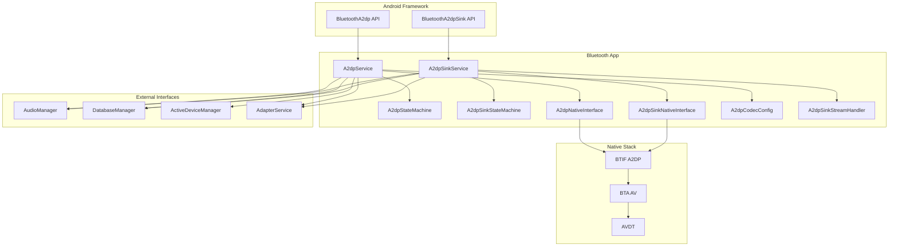
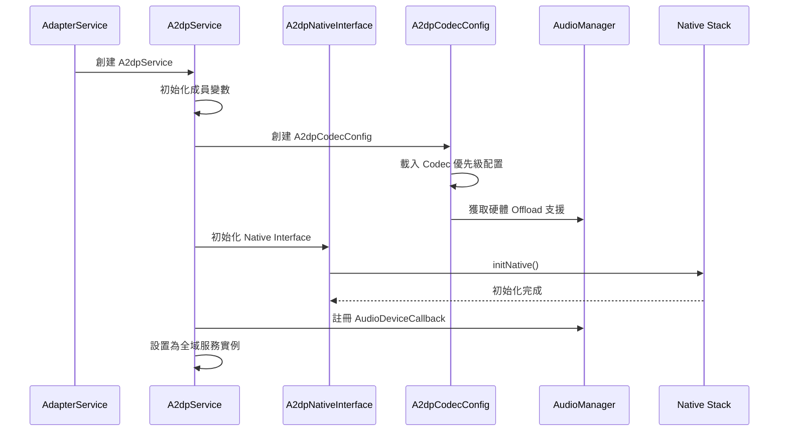
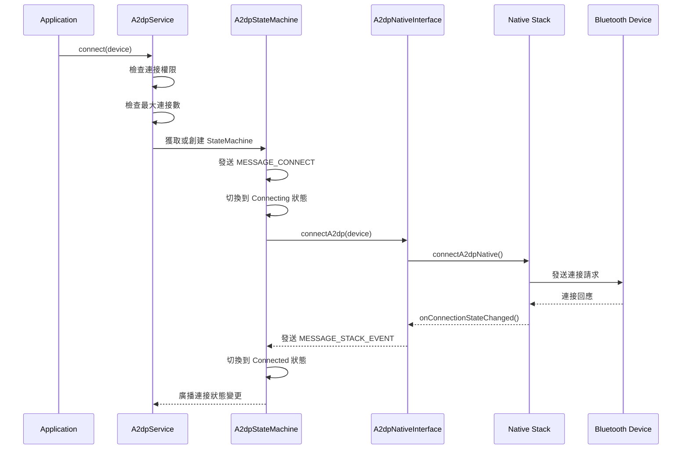
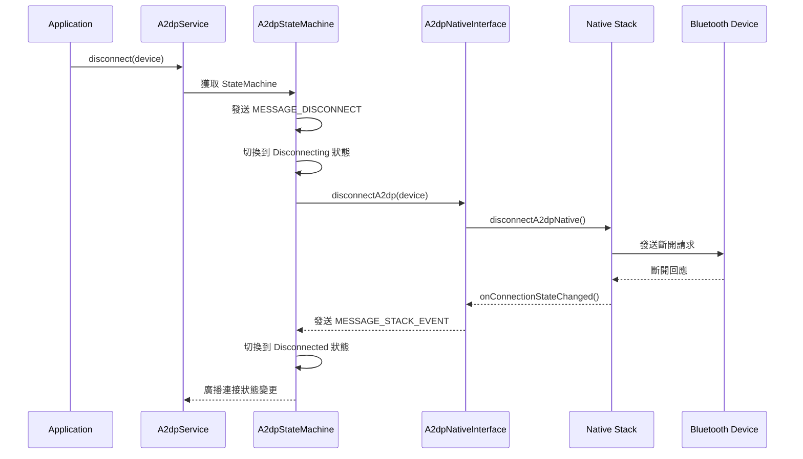
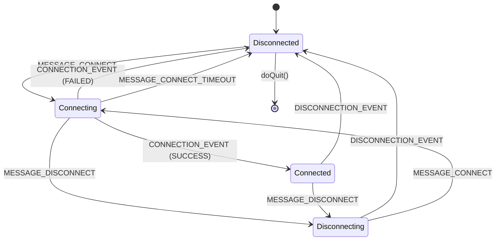
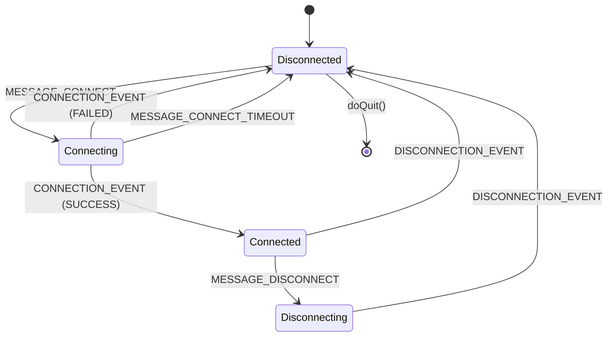
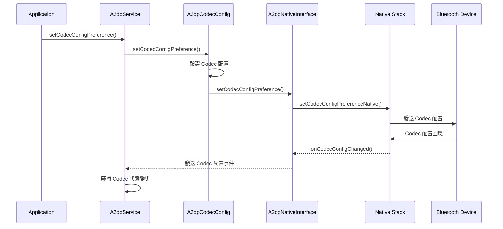
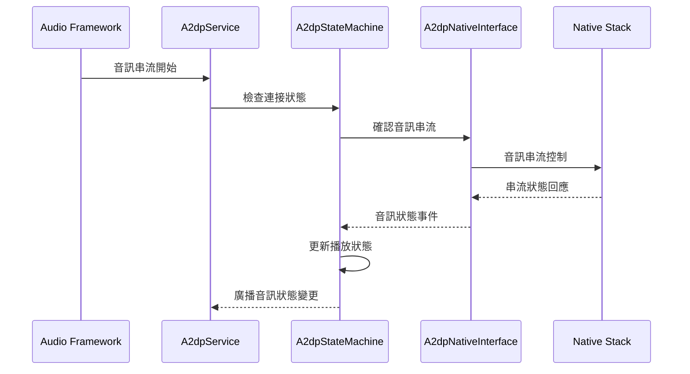
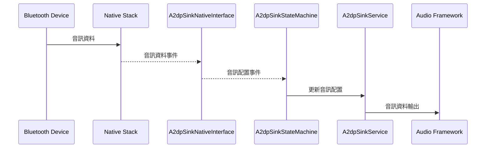

# A2DP Java 架構與流程圖

## 一、整體架構圖

## 二、主要組件說明

### 1. **A2dpService** (Source 端)
- **功能**：A2DP Source 服務，負責音訊輸出到藍牙設備
- **主要職責**：
  - 管理 A2DP 連接狀態
  - 處理音訊串流控制
  - 管理 Codec 配置
  - 與 Audio Framework 互動

### 2. **A2dpSinkService** (Sink 端)
- **功能**：A2DP Sink 服務，負責接收藍牙設備的音訊
- **主要職責**：
  - 管理 A2DP Sink 連接狀態
  - 處理音訊接收
  - 與 Audio Framework 互動

### 3. **A2dpStateMachine** / **A2dpSinkStateMachine**
- **功能**：狀態機，管理每個設備的連接狀態
- **狀態**：Disconnected → Connecting → Connected → Disconnecting

### 4. **A2dpNativeInterface** / **A2dpSinkNativeInterface**
- **功能**：JNI 介面，與 Native Stack 溝通
- **主要方法**：connectA2dp(), disconnectA2dp(), setActiveDevice()

### 5. **A2dpCodecConfig**
- **功能**：管理 A2DP Codec 配置
- **支援的 Codec**：SBC, AAC, APTX, APTX-HD, LDAC, OPUS

## 三、初始化流程圖

## 四、連接流程圖

## 五、斷開連接流程圖

## 六、A2DP Source 狀態機

### 狀態說明

#### **Disconnected 狀態**
- **進入動作**：
  - 設置連接狀態為 `STATE_DISCONNECTED`
  - 移除延遲的斷開訊息
  - 廣播連接狀態變更
  - 如果正在播放，停止播放並廣播音訊狀態
- **處理訊息**：
  - `MESSAGE_CONNECT` → 切換到 Connecting 狀態
  - `MESSAGE_DISCONNECT` → 忽略（已在斷開狀態）

#### **Connecting 狀態**
- **進入動作**：
  - 設置連接狀態為 `STATE_CONNECTING`
  - 廣播連接狀態變更
  - 發送連接請求到 Native Stack
  - 設置連接超時計時器
- **處理訊息**：
  - `CONNECTION_EVENT (SUCCESS)` → 切換到 Connected 狀態
  - `CONNECTION_EVENT (FAILED)` → 切換到 Disconnected 狀態
  - `MESSAGE_CONNECT_TIMEOUT` → 切換到 Disconnected 狀態
  - `MESSAGE_DISCONNECT` → 切換到 Disconnecting 狀態

#### **Connected 狀態**
- **進入動作**：
  - 設置連接狀態為 `STATE_CONNECTED`
  - 廣播連接狀態變更
  - 記錄連接成功
- **處理訊息**：
  - `MESSAGE_DISCONNECT` → 切換到 Disconnecting 狀態
  - `DISCONNECTION_EVENT` → 切換到 Disconnected 狀態
  - `AUDIO_STATE_EVENT` → 處理音訊狀態變更
  - `CODEC_CONFIG_EVENT` → 處理 Codec 配置變更

#### **Disconnecting 狀態**
- **進入動作**：
  - 設置連接狀態為 `STATE_DISCONNECTING`
  - 廣播連接狀態變更
  - 發送斷開請求到 Native Stack
- **處理訊息**：
  - `DISCONNECTION_EVENT` → 切換到 Disconnected 狀態
  - `MESSAGE_CONNECT` → 切換到 Connecting 狀態

## 七、A2DP Sink 狀態機

### 狀態說明

#### **Disconnected 狀態**
- **進入動作**：
  - 設置連接狀態為 `STATE_DISCONNECTED`
  - 廣播連接狀態變更
- **處理訊息**：
  - `MESSAGE_CONNECT` → 切換到 Connecting 狀態
  - `INCOMING_CONNECTION` → 切換到 Connecting 狀態

#### **Connecting 狀態**
- **進入動作**：
  - 設置連接狀態為 `STATE_CONNECTING`
  - 廣播連接狀態變更
  - 設置連接超時計時器
- **處理訊息**：
  - `CONNECTION_EVENT (SUCCESS)` → 切換到 Connected 狀態
  - `CONNECTION_EVENT (FAILED)` → 切換到 Disconnected 狀態
  - `MESSAGE_CONNECT_TIMEOUT` → 切換到 Disconnected 狀態

#### **Connected 狀態**
- **進入動作**：
  - 設置連接狀態為 `STATE_CONNECTED`
  - 廣播連接狀態變更
- **處理訊息**：
  - `MESSAGE_DISCONNECT` → 切換到 Disconnecting 狀態
  - `DISCONNECTION_EVENT` → 切換到 Disconnected 狀態
  - `AUDIO_CONFIG_EVENT` → 處理音訊配置變更

#### **Disconnecting 狀態**
- **進入動作**：
  - 設置連接狀態為 `STATE_DISCONNECTING`
  - 廣播連接狀態變更
- **處理訊息**：
  - `DISCONNECTION_EVENT` → 切換到 Disconnected 狀態

## 八、外部介面說明

### 1. **AudioManager**
- **用途**：音訊設備管理和音訊路由
- **主要互動**：
  - 註冊 `AudioDeviceCallback` 監聽音訊設備變更
  - 獲取硬體 Offload 支援的 Codec
  - 音訊設備切換和路由

### 2. **DatabaseManager**
- **用途**：藍牙設備資料庫管理
- **主要互動**：
  - 儲存/讀取設備連接策略
  - 管理設備配對資訊
  - 儲存 Codec 偏好設定

### 3. **ActiveDeviceManager**
- **用途**：管理活躍設備
- **主要互動**：
  - 設置/移除 A2DP 活躍設備
  - 協調多個音訊 Profile 的活躍設備

### 4. **AdapterService**
- **用途**：藍牙適配器服務
- **主要互動**：
  - 獲取最大連接音訊設備數
  - 檢查 A2DP Offload 支援
  - 設備配對狀態管理

## 九、Codec 配置流程

## 十、音訊串流控制

### **A2DP Source 音訊控制**

### **A2DP Sink 音訊控制**

## 十一、總結

A2DP Java 層的架構設計遵循以下原則：

1. **分層架構**：API 層 → Service 層 → StateMachine 層 → Native Interface 層
2. **狀態機模式**：每個設備都有獨立的狀態機管理連接狀態
3. **事件驅動**：透過訊息機制處理各種事件
4. **模組化設計**：Codec 配置、音訊處理等功能獨立模組
5. **外部介面整合**：與 Audio Framework、Database、Active Device Manager 等緊密整合

這種設計確保了 A2DP 功能的穩定性、可維護性和擴展性。 