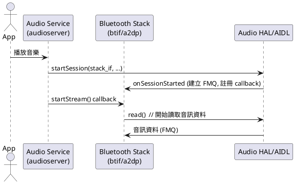

# A2DP Source Streaming 啟動流程與 AIDL Callback 詳解

本文件詳細說明 audio service（audioserver）與 Bluetooth stack 之間，A2DP streaming 啟動時的互動流程，並解釋 audio service 如何知道 Bluetooth stack 的 `startStream()` callback 位置。內容分為 audio service 端與 Bluetooth stack 端兩部分，並附上 PlantUML 時序圖與原始碼對應。

---

## 一、audio service 如何知道 Bluetooth stack 的 startStream() 位置？

### 1. AIDL callback 註冊原理
- Bluetooth stack 會實作一個 `IBluetoothAudioPort`（AIDL interface）的 C++ 類別，並在呼叫 audio HAL 的 `startSession()` 時，**將這個物件的 binder 傳給 audio service**。
- audio service 取得這個 binder 之後，會在需要時呼叫這個物件的 `startStream()`、`suspendStream()` 等 callback。

### 2. 關鍵原始碼對應
- Bluetooth stack 端註冊 callback 的位置：
  - `system/audio_hal_interface/aidl/a2dp/client_interface_aidl.cc`：
    ```cpp
    std::shared_ptr<IBluetoothAudioPort> stack_if =
        ndk::SharedRefBase::make<BluetoothAudioPortImpl>(transport_, provider_);
    auto aidl_retval = provider_->startSession(stack_if, transport_->GetAudioConfiguration(),
                                               latency_modes_, &mq_desc);
    ```
- audio service 端收到 binder 之後，會呼叫 `startStream()`：
  - 這部分在 audioserver 的 AIDL server 端（如 frameworks/av/services/audiohal/）

---

## 二、流程分解

### 1. audio service 端流程
- 應用程式要求播放音樂，audio service 決定 routing 到 Bluetooth A2DP。
- audio service 呼叫 HAL/AIDL 的 `startSession()`，並取得 Bluetooth stack 提供的 callback binder。
- audio service 在適當時機（如資料路徑 ready）呼叫 `startStream()` callback，通知 Bluetooth stack 可以開始串流。

### 2. Bluetooth stack 端流程
- 實作 `IBluetoothAudioPort`（如 `BluetoothAudioPortImpl`），並在 `startSession()` 時傳給 audio service。
- 收到 audio service 的 `startStream()` callback 後，進入 streaming 狀態，開始呼叫 audio HAL 的 `read()` 讀取音訊資料。

---

## 三、PlantUML 時序圖



---

## 四、原始碼對應與 code snippet

### 1. Bluetooth stack 註冊 callback
- 檔案：`system/audio_hal_interface/aidl/a2dp/client_interface_aidl.cc`
- 主要程式片段：
    ```cpp
    // 建立 Bluetooth stack 的 callback 物件
    std::shared_ptr<IBluetoothAudioPort> stack_if =
        ndk::SharedRefBase::make<BluetoothAudioPortImpl>(transport_, provider_);
    // 呼叫 audio HAL 的 startSession，傳入 callback
    auto aidl_retval = provider_->startSession(stack_if, transport_->GetAudioConfiguration(),
                                               latency_modes_, &mq_desc);
    ```

### 2. audio service 端呼叫 startStream()
- 檔案：`frameworks/av/services/audiohal/` 相關 AIDL server 實作
- 主要程式片段（概念）：
    ```cpp
    // audio service 取得 Bluetooth stack callback 之後
    stack_if->startStream(is_low_latency);
    ```

### 3. Bluetooth stack 收到 startStream() callback 後開始讀取資料
- 檔案：`system/audio_hal_interface/aidl/a2dp/bluetooth_audio_port_impl.cc`
- 主要程式片段：
    ```cpp
    ndk::ScopedAStatus BluetoothAudioPortImpl::startStream(bool is_low_latency) {
      Status ack = transport_instance_->StartRequest(is_low_latency);
      // ...
    }
    ```
- 進一步會觸發 stack 進入 streaming 狀態，開始呼叫 `read()` 讀取音訊資料。

---

## 五、總結
- audio service 透過 AIDL callback 機制，主動通知 Bluetooth stack 何時可以開始串流。
- Bluetooth stack 只會在收到 `startStream()` callback 後，才開始呼叫 audio HAL 的 `read()` 來讀取音訊資料。
- 這種設計確保了資料流的同步與正確性。 