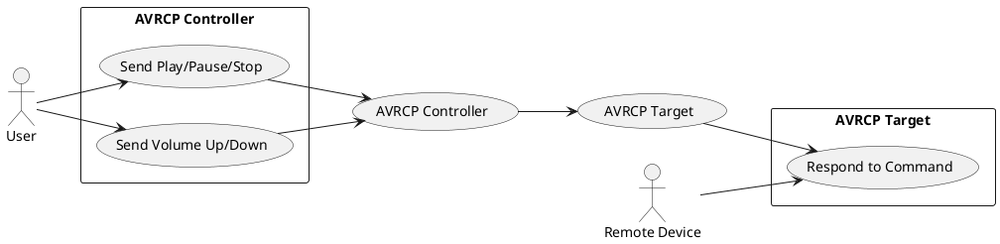

# AVRCP 架構

AVRCP（Audio/Video Remote Control Profile）是一種藍牙協議，允許控制音訊/視訊設備的播放、暫停、停止、音量調整等功能。其架構主要分為 Controller（控制端）與 Target（被控端）。

## 架構說明

- **AVRCP Controller**：發送控制命令（如播放、暫停、音量調整）給 Target。
- **AVRCP Target**：接收並執行 Controller 發送的命令，並回應狀態。
- **User**：操作 Controller 端（如手機、遙控器）。
- **Remote Device**：Target 端設備（如藍牙喇叭、耳機）。

## Use-Case Diagram

## 典型流程
1. User 在 Controller 端操作播放/暫停/音量等功能。
2. Controller 透過 AVRCP 發送命令給 Target。
3. Target 執行命令並回應 Controller。
4. Remote Device 反映狀態變化（如音樂播放、音量變更）。

---

此文件簡要說明了 AVRCP 的基本架構與典型使用情境。 