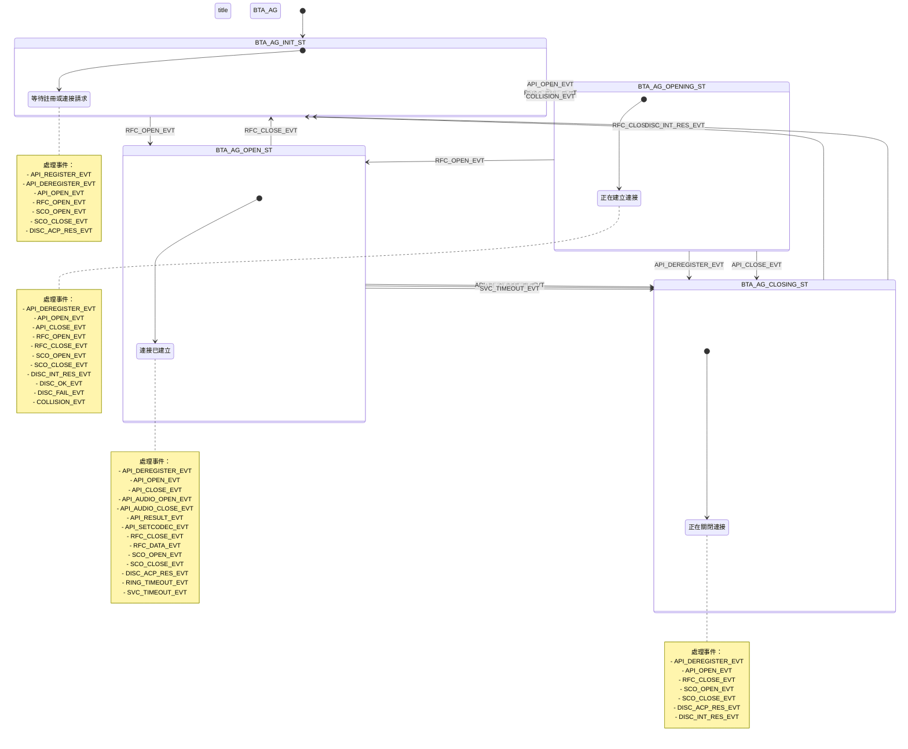

# BTA_AG State Machine

本文檔描述了 BTA_AG (Bluetooth Audio Gateway) 的狀態機，包括所有狀態和事件的轉換關係。

## 狀態機概述

BTA_AG 狀態機管理 HFP (Hands-Free Profile) 和 HSP (Headset Profile) 的連接狀態，包括 RFCOMM 連接和 SCO 音頻連接的管理。

## 狀態定義

BTA_AG 狀態機包含以下四個主要狀態：

- **BTA_AG_INIT_ST**: 初始狀態，等待註冊或連接請求
- **BTA_AG_OPENING_ST**: 正在建立連接狀態
- **BTA_AG_OPEN_ST**: 連接已建立狀態
- **BTA_AG_CLOSING_ST**: 正在關閉連接狀態

## 事件定義

BTA_AG 狀態機處理以下事件：

### API 事件
- **BTA_AG_API_REGISTER_EVT**: 註冊 AG 服務
- **BTA_AG_API_DEREGISTER_EVT**: 註銷 AG 服務
- **BTA_AG_API_OPEN_EVT**: 打開連接
- **BTA_AG_API_CLOSE_EVT**: 關閉連接
- **BTA_AG_API_AUDIO_OPEN_EVT**: 打開音頻連接
- **BTA_AG_API_AUDIO_CLOSE_EVT**: 關閉音頻連接
- **BTA_AG_API_RESULT_EVT**: 處理 API 結果
- **BTA_AG_API_SETCODEC_EVT**: 設置編解碼器

### RFCOMM 事件
- **BTA_AG_RFC_OPEN_EVT**: RFCOMM 連接打開
- **BTA_AG_RFC_CLOSE_EVT**: RFCOMM 連接關閉
- **BTA_AG_RFC_SRV_CLOSE_EVT**: RFCOMM 服務關閉
- **BTA_AG_RFC_DATA_EVT**: RFCOMM 數據事件

### SCO 事件
- **BTA_AG_SCO_OPEN_EVT**: SCO 連接打開
- **BTA_AG_SCO_CLOSE_EVT**: SCO 連接關閉

### 發現事件
- **BTA_AG_DISC_ACP_RES_EVT**: 接受連接的發現結果
- **BTA_AG_DISC_INT_RES_EVT**: 發起連接的發現結果
- **BTA_AG_DISC_OK_EVT**: 發現成功
- **BTA_AG_DISC_FAIL_EVT**: 發現失敗

### 其他事件
- **BTA_AG_RING_TIMEOUT_EVT**: 鈴聲超時
- **BTA_AG_SVC_TIMEOUT_EVT**: 服務超時
- **BTA_AG_COLLISION_EVT**: 衝突事件

## 狀態機圖表

## 詳細狀態轉換表

### BTA_AG_INIT_ST (初始狀態)

| 事件 | 動作 | 下一個狀態 |
|------|------|------------|
| BTA_AG_API_REGISTER_EVT | bta_ag_register() | BTA_AG_INIT_ST |
| BTA_AG_API_DEREGISTER_EVT | bta_ag_deregister() | BTA_AG_INIT_ST |
| BTA_AG_API_OPEN_EVT | bta_ag_start_open() | BTA_AG_OPENING_ST |
| BTA_AG_RFC_OPEN_EVT | bta_ag_rfc_acp_open() + bta_ag_sco_listen() | BTA_AG_OPEN_ST |
| BTA_AG_SCO_OPEN_EVT | bta_ag_sco_conn_open() | BTA_AG_INIT_ST |
| BTA_AG_SCO_CLOSE_EVT | bta_ag_sco_conn_close() | BTA_AG_INIT_ST |
| BTA_AG_DISC_ACP_RES_EVT | bta_ag_free_db() | BTA_AG_INIT_ST |

### BTA_AG_OPENING_ST (正在建立連接)

| 事件 | 動作 | 下一個狀態 |
|------|------|------------|
| BTA_AG_API_DEREGISTER_EVT | bta_ag_rfc_do_close() + bta_ag_start_dereg() | BTA_AG_CLOSING_ST |
| BTA_AG_API_OPEN_EVT | bta_ag_open_fail() | BTA_AG_OPENING_ST |
| BTA_AG_API_CLOSE_EVT | bta_ag_rfc_do_close() | BTA_AG_CLOSING_ST |
| BTA_AG_RFC_OPEN_EVT | bta_ag_rfc_open() + bta_ag_sco_listen() | BTA_AG_OPEN_ST |
| BTA_AG_RFC_CLOSE_EVT | bta_ag_rfc_fail() | BTA_AG_INIT_ST |
| BTA_AG_SCO_OPEN_EVT | bta_ag_sco_conn_open() | BTA_AG_OPENING_ST |
| BTA_AG_SCO_CLOSE_EVT | bta_ag_sco_conn_close() | BTA_AG_OPENING_ST |
| BTA_AG_DISC_INT_RES_EVT | bta_ag_disc_int_res() | BTA_AG_OPENING_ST |
| BTA_AG_DISC_OK_EVT | bta_ag_rfc_do_open() | BTA_AG_OPENING_ST |
| BTA_AG_DISC_FAIL_EVT | bta_ag_disc_fail() | BTA_AG_INIT_ST |
| BTA_AG_COLLISION_EVT | bta_ag_handle_collision() | BTA_AG_INIT_ST |

### BTA_AG_OPEN_ST (連接已建立)

| 事件 | 動作 | 下一個狀態 |
|------|------|------------|
| BTA_AG_API_DEREGISTER_EVT | bta_ag_start_close() + bta_ag_start_dereg() | BTA_AG_CLOSING_ST |
| BTA_AG_API_OPEN_EVT | bta_ag_open_fail() | BTA_AG_OPEN_ST |
| BTA_AG_API_CLOSE_EVT | bta_ag_start_close() | BTA_AG_CLOSING_ST |
| BTA_AG_API_AUDIO_OPEN_EVT | bta_ag_sco_open() | BTA_AG_OPEN_ST |
| BTA_AG_API_AUDIO_CLOSE_EVT | bta_ag_sco_close() | BTA_AG_OPEN_ST |
| BTA_AG_API_RESULT_EVT | bta_ag_result() | BTA_AG_OPEN_ST |
| BTA_AG_API_SETCODEC_EVT | bta_ag_setcodec() | BTA_AG_OPEN_ST |
| BTA_AG_RFC_CLOSE_EVT | bta_ag_rfc_close() | BTA_AG_INIT_ST |
| BTA_AG_RFC_DATA_EVT | bta_ag_rfc_data() | BTA_AG_OPEN_ST |
| BTA_AG_SCO_OPEN_EVT | bta_ag_sco_conn_open() + bta_ag_post_sco_open() | BTA_AG_OPEN_ST |
| BTA_AG_SCO_CLOSE_EVT | bta_ag_sco_conn_close() + bta_ag_post_sco_close() | BTA_AG_OPEN_ST |
| BTA_AG_DISC_ACP_RES_EVT | bta_ag_disc_acp_res() | BTA_AG_OPEN_ST |
| BTA_AG_RING_TIMEOUT_EVT | bta_ag_send_ring() | BTA_AG_OPEN_ST |
| BTA_AG_SVC_TIMEOUT_EVT | bta_ag_start_close() | BTA_AG_CLOSING_ST |

### BTA_AG_CLOSING_ST (正在關閉連接)

| 事件 | 動作 | 下一個狀態 |
|------|------|------------|
| BTA_AG_API_DEREGISTER_EVT | bta_ag_start_dereg() | BTA_AG_CLOSING_ST |
| BTA_AG_API_OPEN_EVT | bta_ag_open_fail() | BTA_AG_CLOSING_ST |
| BTA_AG_RFC_CLOSE_EVT | bta_ag_rfc_close() | BTA_AG_INIT_ST |
| BTA_AG_SCO_OPEN_EVT | bta_ag_sco_conn_open() | BTA_AG_CLOSING_ST |
| BTA_AG_SCO_CLOSE_EVT | bta_ag_sco_conn_close() + bta_ag_post_sco_close() | BTA_AG_CLOSING_ST |
| BTA_AG_DISC_ACP_RES_EVT | bta_ag_free_db() | BTA_AG_CLOSING_ST |
| BTA_AG_DISC_INT_RES_EVT | bta_ag_free_db() | BTA_AG_INIT_ST |

## SCO 子狀態機

BTA_AG 還包含一個 SCO (Synchronous Connection-Oriented) 子狀態機來管理音頻連接：

### SCO 狀態

- **BTA_AG_SCO_SHUTDOWN_ST**: 無 SCO 監聽，所有 SCO 連接已關閉
- **BTA_AG_SCO_LISTEN_ST**: SCO 監聽狀態
- **BTA_AG_SCO_CODEC_ST**: SCO 編解碼器協商狀態
- **BTA_AG_SCO_OPENING_ST**: SCO 連接正在打開
- **BTA_AG_SCO_OPEN_CL_ST**: 正在關閉的 SCO 連接
- **BTA_AG_SCO_OPEN_XFER_ST**: 正在轉移的 SCO 連接
- **BTA_AG_SCO_OPEN_ST**: SCO 已打開
- **BTA_AG_SCO_CLOSING_ST**: SCO 正在關閉
- **BTA_AG_SCO_CLOSE_OP_ST**: 正在關閉的 SCO 連接
- **BTA_AG_SCO_CLOSE_XFER_ST**: 正在轉移的 SCO 連接
- **BTA_AG_SCO_SHUTTING_ST**: SCO 正在關閉

### SCO 事件

- **BTA_AG_SCO_LISTEN_E**: 監聽請求
- **BTA_AG_SCO_OPEN_E**: 打開請求
- **BTA_AG_SCO_XFER_E**: 轉移請求
- **BTA_AG_SCO_CN_DONE_E**: 編解碼器協商完成
- **BTA_AG_SCO_REOPEN_E**: 失敗時重試其他編解碼器
- **BTA_AG_SCO_CLOSE_E**: 關閉請求
- **BTA_AG_SCO_SHUTDOWN_E**: 關閉請求
- **BTA_AG_SCO_CONN_OPEN_E**: SCO 打開
- **BTA_AG_SCO_CONN_CLOSE_E**: SCO 關閉

## 總結

BTA_AG 狀態機是一個複雜的狀態機，管理 HFP/HSP 連接的完整生命週期。它包含主狀態機和 SCO 子狀態機，分別處理 RFCOMM 連接和音頻連接的管理。狀態機通過事件驅動的方式響應各種 API 調用、RFCOMM 事件、SCO 事件和發現事件，確保連接狀態的正確轉換和管理。 