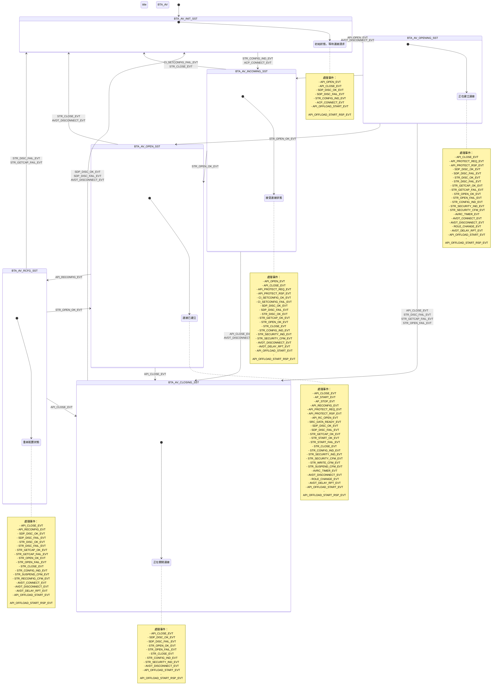

# BTA_AV State Machine

本文檔描述了 BTA_AV (Bluetooth Advanced Audio/Video) 的狀態機，包括所有狀態和事件的轉換關係。

## 狀態機概述

BTA_AV 狀態機管理 A2DP (Advanced Audio Distribution Profile) 和 AVRCP (Audio/Video Remote Control Profile) 的連接狀態，包括 AVDTP 連接和音頻串流的管理。

## 狀態定義

BTA_AV 狀態機包含以下六個主要狀態：

- **BTA_AV_INIT_SST**: 初始狀態，等待連接請求
- **BTA_AV_INCOMING_SST**: 接受連接狀態，處理對方發起的連接
- **BTA_AV_OPENING_SST**: 正在建立連接狀態
- **BTA_AV_OPEN_SST**: 連接已建立狀態
- **BTA_AV_RCFG_SST**: 重新配置狀態
- **BTA_AV_CLOSING_SST**: 正在關閉連接狀態

## 事件定義

BTA_AV 狀態機處理以下事件：

### API 事件
- **BTA_AV_API_OPEN_EVT**: 打開連接
- **BTA_AV_API_CLOSE_EVT**: 關閉連接
- **BTA_AV_API_RECONFIG_EVT**: 重新配置
- **BTA_AV_API_PROTECT_REQ_EVT**: 保護請求
- **BTA_AV_API_PROTECT_RSP_EVT**: 保護響應
- **BTA_AV_API_RC_OPEN_EVT**: 打開遠程控制
- **BTA_AV_API_OFFLOAD_START_EVT**: 開始卸載
- **BTA_AV_API_OFFLOAD_START_RSP_EVT**: 卸載開始響應

### 應用層事件
- **BTA_AV_AP_START_EVT**: 應用開始
- **BTA_AV_AP_STOP_EVT**: 應用停止
- **BTA_AV_SRC_DATA_READY_EVT**: 源數據準備就緒

### 配置事件
- **BTA_AV_CI_SETCONFIG_OK_EVT**: 配置成功
- **BTA_AV_CI_SETCONFIG_FAIL_EVT**: 配置失敗

### SDP 事件
- **BTA_AV_SDP_DISC_OK_EVT**: SDP 發現成功
- **BTA_AV_SDP_DISC_FAIL_EVT**: SDP 發現失敗

### 串流事件
- **BTA_AV_STR_DISC_OK_EVT**: 串流發現成功
- **BTA_AV_STR_DISC_FAIL_EVT**: 串流發現失敗
- **BTA_AV_STR_GETCAP_OK_EVT**: 獲取能力成功
- **BTA_AV_STR_GETCAP_FAIL_EVT**: 獲取能力失敗
- **BTA_AV_STR_OPEN_OK_EVT**: 串流打開成功
- **BTA_AV_STR_OPEN_FAIL_EVT**: 串流打開失敗
- **BTA_AV_STR_START_OK_EVT**: 串流開始成功
- **BTA_AV_STR_START_FAIL_EVT**: 串流開始失敗
- **BTA_AV_STR_CLOSE_EVT**: 串流關閉
- **BTA_AV_STR_CONFIG_IND_EVT**: 串流配置指示
- **BTA_AV_STR_SECURITY_IND_EVT**: 串流安全指示
- **BTA_AV_STR_SECURITY_CFM_EVT**: 串流安全確認
- **BTA_AV_STR_WRITE_CFM_EVT**: 串流寫入確認
- **BTA_AV_STR_SUSPEND_CFM_EVT**: 串流暫停確認
- **BTA_AV_STR_RECONFIG_CFM_EVT**: 串流重新配置確認

### AVDT 事件
- **BTA_AV_AVDT_CONNECT_EVT**: AVDT 連接
- **BTA_AV_AVDT_DISCONNECT_EVT**: AVDT 斷開連接
- **BTA_AV_AVDT_DELAY_RPT_EVT**: AVDT 延遲報告
- **BTA_AV_AVDT_DELAY_RPT_CFM_EVT**: AVDT 延遲報告確認

### 其他事件
- **BTA_AV_ACP_CONNECT_EVT**: 接受連接
- **BTA_AV_ROLE_CHANGE_EVT**: 角色變更
- **BTA_AV_AVRC_TIMER_EVT**: AVRCP 定時器

## 狀態機圖表


```

## 詳細狀態轉換表

### BTA_AV_INIT_SST (初始狀態)

| 事件 | 動作 | 下一個狀態 |
|------|------|------------|
| BTA_AV_API_OPEN_EVT | bta_av_do_disc_a2dp() | BTA_AV_OPENING_SST |
| BTA_AV_API_CLOSE_EVT | bta_av_cleanup() | BTA_AV_INIT_SST |
| BTA_AV_SDP_DISC_OK_EVT | bta_av_free_sdb() | BTA_AV_INIT_SST |
| BTA_AV_SDP_DISC_FAIL_EVT | bta_av_free_sdb() | BTA_AV_INIT_SST |
| BTA_AV_STR_CONFIG_IND_EVT | bta_av_config_ind() | BTA_AV_INCOMING_SST |
| BTA_AV_ACP_CONNECT_EVT | 無動作 | BTA_AV_INCOMING_SST |
| BTA_AV_API_OFFLOAD_START_EVT | bta_av_offload_req() | BTA_AV_INIT_SST |
| BTA_AV_API_OFFLOAD_START_RSP_EVT | bta_av_offload_rsp() | BTA_AV_INIT_SST |

### BTA_AV_INCOMING_SST (接受連接狀態)

| 事件 | 動作 | 下一個狀態 |
|------|------|------------|
| BTA_AV_API_OPEN_EVT | bta_av_open_at_inc() | BTA_AV_INCOMING_SST |
| BTA_AV_API_CLOSE_EVT | bta_av_cco_close() + bta_av_disconnect_req() | BTA_AV_CLOSING_SST |
| BTA_AV_API_PROTECT_REQ_EVT | bta_av_security_req() | BTA_AV_INCOMING_SST |
| BTA_AV_API_PROTECT_RSP_EVT | bta_av_security_rsp() | BTA_AV_INCOMING_SST |
| BTA_AV_CI_SETCONFIG_OK_EVT | bta_av_setconfig_rsp() + bta_av_st_rc_timer() | BTA_AV_INCOMING_SST |
| BTA_AV_CI_SETCONFIG_FAIL_EVT | bta_av_setconfig_rej() + bta_av_cleanup() | BTA_AV_INIT_SST |
| BTA_AV_SDP_DISC_OK_EVT | bta_av_free_sdb() | BTA_AV_INCOMING_SST |
| BTA_AV_SDP_DISC_FAIL_EVT | bta_av_free_sdb() | BTA_AV_INCOMING_SST |
| BTA_AV_STR_DISC_OK_EVT | bta_av_disc_res_as_acp() | BTA_AV_INCOMING_SST |
| BTA_AV_STR_GETCAP_OK_EVT | bta_av_save_caps() | BTA_AV_INCOMING_SST |
| BTA_AV_STR_OPEN_OK_EVT | bta_av_str_opened() | BTA_AV_OPEN_SST |
| BTA_AV_STR_CLOSE_EVT | bta_av_cco_close() + bta_av_cleanup() | BTA_AV_INIT_SST |
| BTA_AV_STR_CONFIG_IND_EVT | bta_av_config_ind() | BTA_AV_INCOMING_SST |
| BTA_AV_STR_SECURITY_IND_EVT | bta_av_security_ind() | BTA_AV_INCOMING_SST |
| BTA_AV_STR_SECURITY_CFM_EVT | bta_av_security_cfm() | BTA_AV_INCOMING_SST |
| BTA_AV_AVDT_DISCONNECT_EVT | bta_av_cco_close() + bta_av_disconnect_req() | BTA_AV_CLOSING_SST |
| BTA_AV_AVDT_DELAY_RPT_EVT | bta_av_delay_co() | BTA_AV_INCOMING_SST |
| BTA_AV_API_OFFLOAD_START_EVT | bta_av_offload_req() | BTA_AV_INCOMING_SST |
| BTA_AV_API_OFFLOAD_START_RSP_EVT | bta_av_offload_rsp() | BTA_AV_INCOMING_SST |

### BTA_AV_OPENING_SST (正在建立連接)

| 事件 | 動作 | 下一個狀態 |
|------|------|------------|
| BTA_AV_API_CLOSE_EVT | bta_av_do_close() | BTA_AV_CLOSING_SST |
| BTA_AV_API_PROTECT_REQ_EVT | bta_av_security_req() | BTA_AV_OPENING_SST |
| BTA_AV_API_PROTECT_RSP_EVT | bta_av_security_rsp() | BTA_AV_OPENING_SST |
| BTA_AV_SDP_DISC_OK_EVT | bta_av_connect_req() | BTA_AV_OPENING_SST |
| BTA_AV_SDP_DISC_FAIL_EVT | bta_av_connect_req() | BTA_AV_OPENING_SST |
| BTA_AV_STR_DISC_OK_EVT | bta_av_disc_results() | BTA_AV_OPENING_SST |
| BTA_AV_STR_DISC_FAIL_EVT | bta_av_open_failed() | BTA_AV_CLOSING_SST |
| BTA_AV_STR_GETCAP_OK_EVT | bta_av_getcap_results() | BTA_AV_OPENING_SST |
| BTA_AV_STR_GETCAP_FAIL_EVT | bta_av_open_failed() | BTA_AV_CLOSING_SST |
| BTA_AV_STR_OPEN_OK_EVT | bta_av_st_rc_timer() + bta_av_str_opened() | BTA_AV_OPEN_SST |
| BTA_AV_STR_OPEN_FAIL_EVT | bta_av_open_failed() | BTA_AV_CLOSING_SST |
| BTA_AV_STR_CONFIG_IND_EVT | bta_av_config_ind() | BTA_AV_INCOMING_SST |
| BTA_AV_STR_SECURITY_IND_EVT | bta_av_security_ind() | BTA_AV_OPENING_SST |
| BTA_AV_STR_SECURITY_CFM_EVT | bta_av_security_cfm() | BTA_AV_OPENING_SST |
| BTA_AV_AVRC_TIMER_EVT | bta_av_switch_role() | BTA_AV_OPENING_SST |
| BTA_AV_AVDT_CONNECT_EVT | bta_av_discover_req() | BTA_AV_OPENING_SST |
| BTA_AV_AVDT_DISCONNECT_EVT | bta_av_conn_failed() | BTA_AV_INIT_SST |
| BTA_AV_ROLE_CHANGE_EVT | bta_av_role_res() | BTA_AV_OPENING_SST |
| BTA_AV_AVDT_DELAY_RPT_EVT | bta_av_delay_co() | BTA_AV_OPENING_SST |
| BTA_AV_API_OFFLOAD_START_EVT | bta_av_offload_req() | BTA_AV_OPENING_SST |
| BTA_AV_API_OFFLOAD_START_RSP_EVT | bta_av_offload_rsp() | BTA_AV_OPENING_SST |

### BTA_AV_OPEN_SST (連接已建立)

| 事件 | 動作 | 下一個狀態 |
|------|------|------------|
| BTA_AV_API_CLOSE_EVT | bta_av_do_close() | BTA_AV_CLOSING_SST |
| BTA_AV_AP_START_EVT | bta_av_do_start() | BTA_AV_OPEN_SST |
| BTA_AV_AP_STOP_EVT | bta_av_str_stopped() | BTA_AV_OPEN_SST |
| BTA_AV_API_RECONFIG_EVT | bta_av_reconfig() | BTA_AV_RCFG_SST |
| BTA_AV_API_PROTECT_REQ_EVT | bta_av_security_req() | BTA_AV_OPEN_SST |
| BTA_AV_API_PROTECT_RSP_EVT | bta_av_security_rsp() | BTA_AV_OPEN_SST |
| BTA_AV_API_RC_OPEN_EVT | bta_av_set_use_rc() | BTA_AV_OPEN_SST |
| BTA_AV_SRC_DATA_READY_EVT | bta_av_data_path() | BTA_AV_OPEN_SST |
| BTA_AV_SDP_DISC_OK_EVT | bta_av_free_sdb() | BTA_AV_OPEN_SST |
| BTA_AV_SDP_DISC_FAIL_EVT | bta_av_free_sdb() | BTA_AV_OPEN_SST |
| BTA_AV_STR_GETCAP_OK_EVT | bta_av_save_caps() | BTA_AV_OPEN_SST |
| BTA_AV_STR_START_OK_EVT | bta_av_start_ok() | BTA_AV_OPEN_SST |
| BTA_AV_STR_START_FAIL_EVT | bta_av_start_failed() | BTA_AV_OPEN_SST |
| BTA_AV_STR_CLOSE_EVT | bta_av_str_closed() | BTA_AV_INIT_SST |
| BTA_AV_STR_CONFIG_IND_EVT | bta_av_setconfig_rej() | BTA_AV_OPEN_SST |
| BTA_AV_STR_SECURITY_IND_EVT | bta_av_security_ind() | BTA_AV_OPEN_SST |
| BTA_AV_STR_SECURITY_CFM_EVT | bta_av_security_cfm() | BTA_AV_OPEN_SST |
| BTA_AV_STR_WRITE_CFM_EVT | bta_av_clr_cong() + bta_av_data_path() | BTA_AV_OPEN_SST |
| BTA_AV_STR_SUSPEND_CFM_EVT | bta_av_suspend_cfm() | BTA_AV_OPEN_SST |
| BTA_AV_AVRC_TIMER_EVT | bta_av_open_rc() | BTA_AV_OPEN_SST |
| BTA_AV_AVDT_DISCONNECT_EVT | bta_av_str_closed() | BTA_AV_INIT_SST |
| BTA_AV_ROLE_CHANGE_EVT | bta_av_role_res() | BTA_AV_OPEN_SST |
| BTA_AV_AVDT_DELAY_RPT_EVT | bta_av_delay_co() | BTA_AV_OPEN_SST |
| BTA_AV_API_OFFLOAD_START_EVT | bta_av_offload_req() | BTA_AV_OPEN_SST |
| BTA_AV_API_OFFLOAD_START_RSP_EVT | bta_av_offload_rsp() | BTA_AV_OPEN_SST |

### BTA_AV_RCFG_SST (重新配置狀態)

| 事件 | 動作 | 下一個狀態 |
|------|------|------------|
| BTA_AV_API_CLOSE_EVT | bta_av_disconnect_req() | BTA_AV_CLOSING_SST |
| BTA_AV_API_RECONFIG_EVT | bta_av_reconfig() | BTA_AV_RCFG_SST |
| BTA_AV_SDP_DISC_OK_EVT | bta_av_free_sdb() | BTA_AV_RCFG_SST |
| BTA_AV_SDP_DISC_FAIL_EVT | bta_av_free_sdb() | BTA_AV_RCFG_SST |
| BTA_AV_STR_DISC_OK_EVT | bta_av_disc_results() | BTA_AV_RCFG_SST |
| BTA_AV_STR_DISC_FAIL_EVT | bta_av_str_closed() | BTA_AV_INIT_SST |
| BTA_AV_STR_GETCAP_OK_EVT | bta_av_getcap_results() | BTA_AV_RCFG_SST |
| BTA_AV_STR_GETCAP_FAIL_EVT | bta_av_str_closed() | BTA_AV_INIT_SST |
| BTA_AV_STR_OPEN_OK_EVT | bta_av_rcfg_str_ok() | BTA_AV_OPEN_SST |
| BTA_AV_STR_OPEN_FAIL_EVT | bta_av_rcfg_failed() | BTA_AV_RCFG_SST |
| BTA_AV_STR_CLOSE_EVT | bta_av_rcfg_connect() | BTA_AV_RCFG_SST |
| BTA_AV_STR_CONFIG_IND_EVT | bta_av_setconfig_rej() | BTA_AV_RCFG_SST |
| BTA_AV_STR_SUSPEND_CFM_EVT | bta_av_suspend_cfm() + bta_av_suspend_cont() | BTA_AV_RCFG_SST |
| BTA_AV_STR_RECONFIG_CFM_EVT | bta_av_rcfg_cfm() | BTA_AV_RCFG_SST |
| BTA_AV_AVDT_CONNECT_EVT | bta_av_rcfg_open() | BTA_AV_RCFG_SST |
| BTA_AV_AVDT_DISCONNECT_EVT | bta_av_rcfg_discntd() | BTA_AV_RCFG_SST |
| BTA_AV_AVDT_DELAY_RPT_EVT | bta_av_delay_co() | BTA_AV_RCFG_SST |
| BTA_AV_API_OFFLOAD_START_EVT | bta_av_offload_req() | BTA_AV_RCFG_SST |
| BTA_AV_API_OFFLOAD_START_RSP_EVT | bta_av_offload_rsp() | BTA_AV_RCFG_SST |

### BTA_AV_CLOSING_SST (正在關閉連接)

| 事件 | 動作 | 下一個狀態 |
|------|------|------------|
| BTA_AV_API_CLOSE_EVT | bta_av_disconnect_req() | BTA_AV_CLOSING_SST |
| BTA_AV_SDP_DISC_OK_EVT | bta_av_sdp_failed() | BTA_AV_INIT_SST |
| BTA_AV_SDP_DISC_FAIL_EVT | bta_av_sdp_failed() | BTA_AV_INIT_SST |
| BTA_AV_STR_OPEN_OK_EVT | bta_av_do_close() | BTA_AV_CLOSING_SST |
| BTA_AV_STR_OPEN_FAIL_EVT | bta_av_disconnect_req() | BTA_AV_CLOSING_SST |
| BTA_AV_STR_CLOSE_EVT | bta_av_disconnect_req() | BTA_AV_CLOSING_SST |
| BTA_AV_STR_CONFIG_IND_EVT | bta_av_setconfig_rej() | BTA_AV_CLOSING_SST |
| BTA_AV_STR_SECURITY_IND_EVT | bta_av_security_rej() | BTA_AV_CLOSING_SST |
| BTA_AV_AVDT_DISCONNECT_EVT | bta_av_str_closed() | BTA_AV_INIT_SST |
| BTA_AV_API_OFFLOAD_START_EVT | bta_av_offload_req() | BTA_AV_CLOSING_SST |
| BTA_AV_API_OFFLOAD_START_RSP_EVT | bta_av_offload_rsp() | BTA_AV_CLOSING_SST |

## 主要狀態轉換流程

### 1. 連接建立流程
```
INIT → OPENING → OPEN
     ↓
  INCOMING → OPEN
```

### 2. 連接關閉流程
```
OPEN → CLOSING → INIT
OPENING → CLOSING → INIT
INCOMING → CLOSING → INIT
```

### 3. 重新配置流程
```
OPEN → RCFG → OPEN
```

### 4. 接受連接流程
```
INIT → INCOMING → OPEN
```

## 狀態機特點

1. **雙向連接支援**: 支援主動連接和被動接受連接
2. **重新配置能力**: 支援串流運行時的編解碼器重新配置
3. **安全機制**: 支援 AVDTP 安全機制
4. **卸載支援**: 支援音頻卸載到控制器
5. **延遲報告**: 支援 AVDTP 延遲報告機制
6. **角色切換**: 支援連接建立過程中的角色切換

這個狀態機設計確保了 A2DP 連接的穩定性和可靠性，能夠處理各種連接場景和異常情況。 