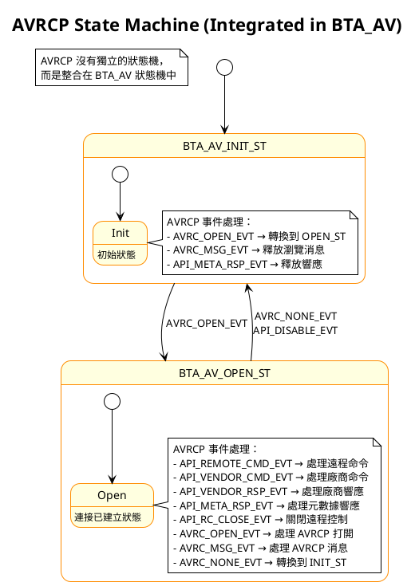

# BTA AVRCP State Machine

本文檔描述了 AVRCP (Audio/Video Remote Control Profile) 在 BTA layer 的狀態機實現。

## 重要說明

**AVRCP 在 BTA layer 並沒有獨立的狀態機**。AVRCP 的功能是整合在 BTA_AV 狀態機中的，作為 A2DP (Advanced Audio Distribution Profile) 的一部分。

## AVRCP 在 BTA_AV 中的整合

### 1. **共享狀態機架構**

AVRCP 使用與 A2DP 相同的狀態機架構：

```c
// BTA_AV 主狀態機狀態
enum {
  BTA_AV_INIT_ST,    // 初始狀態
  BTA_AV_OPEN_ST     // 連接已建立狀態
};

// BTA_AV 串流狀態機狀態
enum {
  BTA_AV_INIT_SST,      // 初始狀態
  BTA_AV_INCOMING_SST,  // 接受連接狀態
  BTA_AV_OPENING_SST,   // 正在建立連接狀態
  BTA_AV_OPEN_SST,      // 連接已建立狀態
  BTA_AV_RCFG_SST,      // 重新配置狀態
  BTA_AV_CLOSING_SST    // 正在關閉連接狀態
};
```

### 2. **AVRCP 相關事件**

AVRCP 在 BTA_AV 狀態機中處理以下事件：

#### 主狀態機事件 (BTA_AV_CB)
```c
// AVRCP 連接事件
BTA_AV_AVRC_OPEN_EVT      // AVRCP 連接打開
BTA_AV_AVRC_MSG_EVT       // AVRCP 消息
BTA_AV_AVRC_NONE_EVT      // AVRCP 無事件

// AVRCP API 事件
BTA_AV_API_REMOTE_CMD_EVT // 遠程命令
BTA_AV_API_VENDOR_CMD_EVT // 廠商命令
BTA_AV_API_VENDOR_RSP_EVT // 廠商響應
BTA_AV_API_META_RSP_EVT   // 元數據響應
BTA_AV_API_RC_CLOSE_EVT   // 關閉遠程控制
```

#### 非狀態機事件 (直接處理)
```c
// AVRCP 連接管理
BTA_AV_AVRC_CLOSE_EVT           // AVRCP 連接關閉
BTA_AV_AVRC_BROWSE_OPEN_EVT     // AVRCP 瀏覽連接打開
BTA_AV_AVRC_BROWSE_CLOSE_EVT    // AVRCP 瀏覽連接關閉

// AVRCP 功能事件
BTA_AV_REMOTE_CMD_EVT           // 遠程命令事件
BTA_AV_REMOTE_RSP_EVT           // 遠程響應事件
BTA_AV_VENDOR_CMD_EVT           // 廠商命令事件
BTA_AV_VENDOR_RSP_EVT           // 廠商響應事件
BTA_AV_META_MSG_EVT             // 元數據消息事件
BTA_AV_RC_FEAT_EVT              // 遠程控制功能事件
BTA_AV_RC_PSM_EVT               // 遠程控制 PSM 事件
```

## AVRCP 狀態機圖表



## AVRCP 在串流狀態機中的處理

### BTA_AV_OPEN_SST 狀態中的 AVRCP 處理

```c
case BTA_AV_OPEN_SST:
  switch (event) {
    case BTA_AV_API_RC_OPEN_EVT:
      event_handler1 = &bta_av_set_use_rc;  // 設置使用遠程控制
      break;
    case BTA_AV_AVRC_TIMER_EVT:
      event_handler1 = &bta_av_open_rc;     // 打開遠程控制
      break;
    // ... 其他 A2DP 事件
  }
```

## AVRCP 事件處理函數

### 1. **連接管理函數**
```c
void bta_av_rc_opened(tBTA_AV_CB* p_cb, tBTA_AV_DATA* p_data);
void bta_av_rc_close(tBTA_AV_CB* p_cb, tBTA_AV_DATA* p_data);
void bta_av_rc_free_rsp(tBTA_AV_CB* p_cb, tBTA_AV_DATA* p_data);
void bta_av_rc_free_browse_msg(tBTA_AV_CB* p_cb, tBTA_AV_DATA* p_data);
```

### 2. **命令處理函數**
```c
void bta_av_rc_remote_cmd(tBTA_AV_CB* p_cb, tBTA_AV_DATA* p_data);
void bta_av_rc_vendor_cmd(tBTA_AV_CB* p_cb, tBTA_AV_DATA* p_data);
void bta_av_rc_vendor_rsp(tBTA_AV_CB* p_cb, tBTA_AV_DATA* p_data);
void bta_av_rc_meta_rsp(tBTA_AV_CB* p_cb, tBTA_AV_DATA* p_data);
void bta_av_rc_msg(tBTA_AV_CB* p_cb, tBTA_AV_DATA* p_data);
```

### 3. **串流狀態機函數**
```c
void bta_av_set_use_rc(tBTA_AV_SCB* p_scb, tBTA_AV_DATA* p_data);
void bta_av_open_rc(tBTA_AV_SCB* p_scb, tBTA_AV_DATA* p_data);
void bta_av_st_rc_timer(tBTA_AV_SCB* p_scb, tBTA_AV_DATA* p_data);
```

## AVRCP 控制塊結構

### RCB (Remote Control Block)
```c
typedef struct {
  uint8_t status;
  uint8_t handle;
  uint8_t shdl;               // 串流句柄 (hdi + 1)
  uint8_t lidx;               // (index+1) 到 LCB
  tBTA_AV_FEAT peer_features; // 對等設備功能掩碼
  uint16_t cover_art_psm;     // BIP PSM for cover art 功能
  tBTA_AV_FEAT peer_ct_features;
  tBTA_AV_FEAT peer_tg_features;
} tBTA_AV_RCB;
```

## AVRCP 功能特性

### 支援的功能
```c
typedef enum {
  BTRC_FEAT_NONE = 0x00,            // AVRCP 1.0
  BTRC_FEAT_METADATA = 0x01,        // AVRCP 1.3
  BTRC_FEAT_ABSOLUTE_VOLUME = 0x02, // 支援 TG 角色和音量同步
  BTRC_FEAT_BROWSE = 0x04,          // AVRCP 1.4+ 瀏覽支援
  BTRC_FEAT_COVER_ARTWORK = 0x8,    // AVRCP 1.6+ 封面藝術
} btrc_remote_features_t;
```

### 播放狀態
```c
typedef enum {
  BTRC_PLAYSTATE_STOPPED = 0x00,  // 停止
  BTRC_PLAYSTATE_PLAYING = 0x01,  // 播放中
  BTRC_PLAYSTATE_PAUSED = 0x02,   // 暫停
  BTRC_PLAYSTATE_FWD_SEEK = 0x03, // 向前搜尋
  BTRC_PLAYSTATE_REV_SEEK = 0x04, // 向後搜尋
  BTRC_PLAYSTATE_ERROR = 0xFF,    // 錯誤
} btrc_play_status_t;
```

## AVRCP 事件類型

### 通知事件
```c
typedef enum {
  BTRC_EVT_PLAY_STATUS_CHANGED = 0x01,
  BTRC_EVT_TRACK_CHANGE = 0x02,
  BTRC_EVT_TRACK_REACHED_END = 0x03,
  BTRC_EVT_TRACK_REACHED_START = 0x04,
  BTRC_EVT_PLAY_POS_CHANGED = 0x05,
  BTRC_EVT_APP_SETTINGS_CHANGED = 0x08,
  BTRC_EVT_NOW_PLAYING_CONTENT_CHANGED = 0x09,
  BTRC_EVT_AVAL_PLAYER_CHANGE = 0x0a,
  BTRC_EVT_ADDR_PLAYER_CHANGE = 0x0b,
  BTRC_EVT_UIDS_CHANGED = 0x0c,
  BTRC_EVT_VOL_CHANGED = 0x0d,
} btrc_event_id_t;
```

## 與 Java 層的對應關係

### Java 層狀態機
Java 層有獨立的 AVRCP 狀態機 (`AvrcpControllerStateMachine`)，包含：

```java
// 狀態
- Disconnected    // 斷開連接
- Connecting      // 正在連接
- Connected       // 已連接
- Disconnecting   // 正在斷開連接
- GetFolderList   // 獲取文件夾列表 (子狀態)

// 事件
- CONNECT = 1
- DISCONNECT = 2
- ACTIVE_DEVICE_CHANGE = 3
- AUDIO_FOCUS_STATE_CHANGE = 4
- STACK_EVENT = 200
// ... 更多事件
```

## 總結

1. **AVRCP 在 BTA layer 沒有獨立的狀態機**，而是整合在 BTA_AV 狀態機中
2. **AVRCP 功能通過事件處理**，在主狀態機和串流狀態機中都有相應的處理
3. **Java 層有獨立的 AVRCP 狀態機**，負責更高層次的 AVRCP 功能管理
4. **AVRCP 支援多種功能**，包括基本控制、元數據、瀏覽、封面藝術等
5. **狀態轉換相對簡單**，主要在 INIT 和 OPEN 兩個狀態之間切換

這種設計使得 AVRCP 能夠與 A2DP 緊密協作，共享連接狀態，同時保持功能的獨立性。 