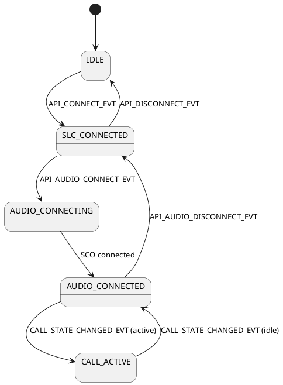
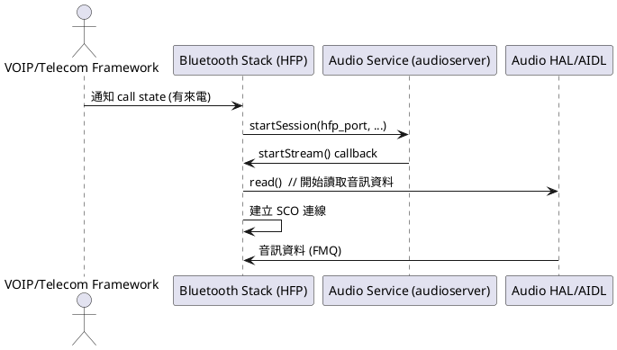

# HFP (Hands-Free Profile) 與 Audio Service 互動流程

本文件說明 HFP (Hands-Free Profile) 在 Android Bluetooth stack 中，如何與 audio service 互動，包含 AIDL 介面、callback 註冊、主要 state machine 與 event，以及一通 VOIP 來時的完整資料流。

---

## 一、HFP 與 Audio Service 的互動介面

### 1. 使用的 AIDL 介面
- HFP 透過 `IBluetoothAudioProvider` (AIDL) 與 audio service 溝通。
- 相關 AIDL 定義在 `hardware/interfaces/bluetooth/audio/aidl/` 目錄下。
- 主要互動介面：
  - `IBluetoothAudioProvider`：audio service 提供，HFP 端呼叫
  - `IBluetoothAudioPort`：HFP stack 實作，audio service 透過 callback 呼叫

### 2. 初始化與 callback 註冊
- HFP stack 初始化時，會：
  1. 建立 `IBluetoothAudioPort` 的實例（C++ 實作 callback）
  2. 呼叫 audio service 的 `startSession()`，將 `IBluetoothAudioPort` 傳給 audio service
  3. audio service 之後會透過這個 port callback 通知 HFP 事件（如 startStream、suspendStream 等）

#### 主要程式片段：
```cpp
// HFP stack 端
std::shared_ptr<IBluetoothAudioPort> hfp_port = ...;
audioProvider->startSession(hfp_port, ...); // 註冊 callback
```

---

## 二、HFP 主要 State Machine 與 Events

### 1. 狀態機簡述
- HFP 主要狀態機管理 SCO 音訊連線、通話狀態、AT 指令交換等
- 典型狀態：
  - `IDLE`：無通話/無音訊連線
  - `SLC_CONNECTED`：AT channel 已建立
  - `AUDIO_CONNECTING`：正在建立 SCO 音訊連線
  - `AUDIO_CONNECTED`：SCO 音訊連線已建立
  - `CALL_ACTIVE`：有通話進行中
  - `DISCONNECTING`：正在斷線

### 2. 主要 Events
- `API_CONNECT_EVT`：應用層要求建立連線
- `API_DISCONNECT_EVT`：應用層要求斷線
- `API_AUDIO_CONNECT_EVT`：要求建立 SCO 音訊
- `API_AUDIO_DISCONNECT_EVT`：要求斷開 SCO 音訊
- `AT_CMD_EVT`：收到 AT 指令
- `CALL_STATE_CHANGED_EVT`：通話狀態改變
- `AUDIO_SERVICE_EVENT`：audio service callback（如 startStream、suspendStream）

#### 狀態機圖


---

## 三、VOIP 來電時的完整資料流

### 1. 流程概述
1. **Framework (Telecom/Telephony/VOIP app) 通知 Bluetooth stack 有來電**
2. Bluetooth stack 更新 call state，並通知 audio service 需要建立 SCO audio
3. Bluetooth stack 呼叫 audio HAL/AIDL 的 `startSession()`，註冊 callback
4. audio service 準備好後，透過 callback (`startStream()`) 通知 HFP stack 可以開始串流
5. HFP stack 呼叫 audio HAL 的 `read()` 開始接收音訊資料，並建立 SCO 連線
6. 音訊資料流通，通話開始

### 2. 詳細時序圖


### 3. 關鍵互動說明
- **Framework 通知 Bluetooth stack**：
  - 透過 JNI/Binder 呼叫 HFP 相關 API，更新 call state
- **Bluetooth stack 通知 audio service**：
  - 呼叫 audio HAL/AIDL 的 `startSession()`，註冊 callback
- **audio service 通知 HFP**：
  - 透過 `IBluetoothAudioPort` callback 的 `startStream()` 通知 HFP stack
- **HFP 開始串流**：
  - HFP stack 呼叫 audio HAL 的 `read()`，並建立 SCO 連線

---

## 四、HFP 與 Audio Service 互動的 AIDL 介面

- 主要使用 `IBluetoothAudioProvider` (AIDL) 進行 session 管理
- HFP stack 實作 `IBluetoothAudioPort`，audio service 透過 callback 通知 HFP
- 相關 AIDL 介面定義於 `hardware/interfaces/bluetooth/audio/aidl/`

---

## 五、流程總結
- HFP stack 初始化時，會註冊 callback 給 audio service
- 通話來時，framework 先通知 Bluetooth stack，Bluetooth stack 再通知 audio service
- audio service 準備好後，透過 callback 通知 HFP stack 可以開始串流
- HFP stack 開始呼叫 audio HAL 的 `read()` 並建立 SCO 連線，完成音訊通路串接 

---

## 六、細節 code 追蹤與 AIDL 介面內容

### 1. 主要 AIDL 介面與 proxy/stub

- **AIDL 介面定義**（AOSP 標準路徑，Android 12+）：
  - `hardware/interfaces/bluetooth/audio/aidl/android/hardware/bluetooth/audio/IBluetoothAudioProvider.aidl`
  - `hardware/interfaces/bluetooth/audio/aidl/android/hardware/bluetooth/audio/IBluetoothAudioPort.aidl`
- **C++ include 路徑**（AIDL 產生的 header）：
  - `#include <aidl/android/hardware/bluetooth/audio/IBluetoothAudioProvider.h>`
  - `#include <aidl/android/hardware/bluetooth/audio/IBluetoothAudioPort.h>`
  - 參見 `system/audio_hal_interface/aidl/a2dp/audio_aidl_interfaces.h` (line 13~40)

### 2. HFP 與 audio service 互動的 C++ 主要檔案

- **HFP AIDL client 實作**：
  - `system/audio_hal_interface/aidl/hfp_client_interface_aidl.h` (整份檔案)
  - `system/audio_hal_interface/aidl/hfp_client_interface_aidl.cc` (整份檔案)
- **AIDL callback 實作（audio port）**：
  - `system/audio_hal_interface/aidl/a2dp/bluetooth_audio_port_impl.h` (line 19~64)
  - `system/audio_hal_interface/aidl/a2dp/bluetooth_audio_port_impl.cc` (整份檔案)
- **AIDL client interface 封裝**：
  - `system/audio_hal_interface/aidl/client_interface_aidl.h` (整份檔案)

### 3. 重要 code snippet 與行號

#### (A) HFP 初始化與 callback 註冊

- `system/audio_hal_interface/aidl/hfp_client_interface_aidl.cc` (line 108~140)
  ```cpp
  BluetoothAudioCtrlAck HfpTransport::StartRequest() {
    // ... 省略 ...
    auto cb = get_hfp_active_device_callback();
    if (cb == nullptr) {
      return BluetoothAudioCtrlAck::FAILURE;
    }
    // ... 省略 ...
    auto status = bluetooth::headset::GetInterface()->ConnectAudio(&cb->peer_addr, 0);
    // ... 省略 ...
  }
  ```

- `system/audio_hal_interface/aidl/hfp_client_interface_aidl.h` (line 38~178)
  ```cpp
  class HfpTransport {
    // ... 省略 ...
    BluetoothAudioCtrlAck StartRequest();
    // ... 省略 ...
  };
  ```

#### (B) AIDL 介面 include

- `system/audio_hal_interface/aidl/a2dp/audio_aidl_interfaces.h` (line 13~40)
  ```cpp
  #include <aidl/android/hardware/bluetooth/audio/IBluetoothAudioProvider.h>
  #include <aidl/android/hardware/bluetooth/audio/IBluetoothAudioPort.h>
  ```

#### (C) Audio port callback 實作

- `system/audio_hal_interface/aidl/a2dp/bluetooth_audio_port_impl.h` (line 19~64)
  ```cpp
  class BluetoothAudioPortImpl : public BnBluetoothAudioPort {
    ndk::ScopedAStatus startStream(bool is_low_latency) override;
    ndk::ScopedAStatus suspendStream() override;
    ndk::ScopedAStatus stopStream() override;
    // ...
  };
  ```

- `system/audio_hal_interface/aidl/a2dp/bluetooth_audio_port_impl.cc` (line 27~55)
  ```cpp
  ndk::ScopedAStatus BluetoothAudioPortImpl::startStream(bool is_low_latency) {
    Status ack = transport_instance_->StartRequest(is_low_latency);
    if (ack != Status::PENDING) {
      auto aidl_retval = provider_->streamStarted(StatusToHalStatus(ack));
      // ...
    }
    return ndk::ScopedAStatus::ok();
  }
  ```

#### (D) AIDL client interface 封裝

- `system/audio_hal_interface/aidl/client_interface_aidl.h` (line 38~214)
  ```cpp
  class BluetoothAudioClientInterface {
    // ... 省略 ...
    int StartSession();
    int EndSession();
    // ...
  };
  ```

### 4. 互動流程 code 對應

- **HFP stack 呼叫 audio service 的 AIDL**：
  - `StartSession()` → 註冊 `IBluetoothAudioPort` callback
  - 參見 `client_interface_aidl.h`/`.cc`、`hfp_client_interface_aidl.h`/`.cc`
- **audio service 透過 callback 通知 HFP**：
  - `startStream()`、`suspendStream()` → 由 `BluetoothAudioPortImpl` 實作
  - 參見 `bluetooth_audio_port_impl.h`/`.cc`

---

## 七、AIDL 介面內容（摘要）

### IBluetoothAudioProvider.aidl（標準 AOSP 定義）

```aidl
interface IBluetoothAudioProvider {
    void startSession(in IBluetoothAudioPort port, in AudioConfiguration config, ...);
    void endSession(...);
    // ... 其他 audio 控制方法 ...
}
```

### IBluetoothAudioPort.aidl（標準 AOSP 定義）

```aidl
interface IBluetoothAudioPort {
    void startStream(boolean isLowLatency);
    void suspendStream();
    void stopStream();
    // ... 其他 callback ...
}
```

---

## 八、補充說明

- **所有 AIDL 介面 proxy/stub** 會在 build 時自動產生於 out/soong/.intermediates/ 下，C++ 端 include 由 `audio_aidl_interfaces.h` 統一管理。
- **HFP/A2DP 互動流程與 AIDL 介面設計**完全一致，僅 session type 與 transport 實作不同。 

---

## 九、檔名命名規則與 AIDL 檔案說明

### 1. `hfp_client_interface_aidl.h` 的命名含義
- **`hfp_client`**：這裡的 `client` 指的是「HFP Client Profile」（即 HFP 的 Client 角色，通常是手機/主機端），而不是「AIDL client」的意思。
- **`interface`**：這裡通常指「C++ 介面/封裝」，而不是 AIDL interface。
- **`aidl`**：這個字尾代表「這個檔案是用來包裝/對應 AIDL 介面」的 C++ 實作（但不是 AIDL 工具自動產生的 header）。

#### 例子
- `hfp_client_interface_aidl.h`  
  → 這是「HFP Client 角色」的 C++ interface，專門用來和 audio AIDL 互動的封裝，不是 AIDL 自動產生的檔案。

### 2. 命名規則與區分

#### (A) `client` 在前面
- 代表這個 interface 是「某個 profile 的 client 角色」。
- 例如：`hfp_client_interface_aidl.h` → HFP Client 角色的 interface。

#### (B) `client` 在後面
- 代表這是「AIDL client 端」的封裝（通常是呼叫 AIDL 的那一方）。
- 例如：`bluetooth_audio_client_interface.h` → audio AIDL 的 client 端 C++ 封裝。

#### (C) `aidl` 在檔名最後
- 代表這個檔案是「**針對 AIDL 介面設計的 C++ 封裝**」，**不是** AIDL 工具自動產生的 header。
- 真正 AIDL 工具產生的 header 會是 `IBluetoothAudioProvider.h` 這種格式，且通常在 `out/` 或 `gen/` 目錄下。

### 3. AIDL 工具自動產生的檔案命名
- 會直接對應 AIDL interface 名稱，如：
  - `IBluetoothAudioProvider.aidl` → 產生 `IBluetoothAudioProvider.h`、`BnBluetoothAudioProvider.h`、`BpBluetoothAudioProvider.h`
- 這些檔案**不會**有 `_aidl.h` 這種字尾。

### 4. 實務命名建議
- **profile_client_interface_aidl.h**  
  → 某 profile（如 hfp_client）角色的 C++ interface，專門包裝 AIDL 互動
- **xxx_aidl.h**  
  → 只要有 `_aidl` 字尾，通常是「手寫的 C++ 封裝，對應 AIDL 介面」
- **IXXX.h/BnXXX.h/BpXXX.h**  
  → 這是 AIDL 工具自動產生的 proxy/stub/header

### 5. 總結
- `hfp_client_interface_aidl.h` 是「HFP Client 角色」的 C++ interface，專門包裝 AIDL 互動，不是 AIDL 工具自動產生的 header。
- 命名上，`client` 在前面通常指 profile 角色，在後面才是 AIDL client 封裝。
- `aidl.h` 字尾代表「AIDL 封裝」而非自動產生。 