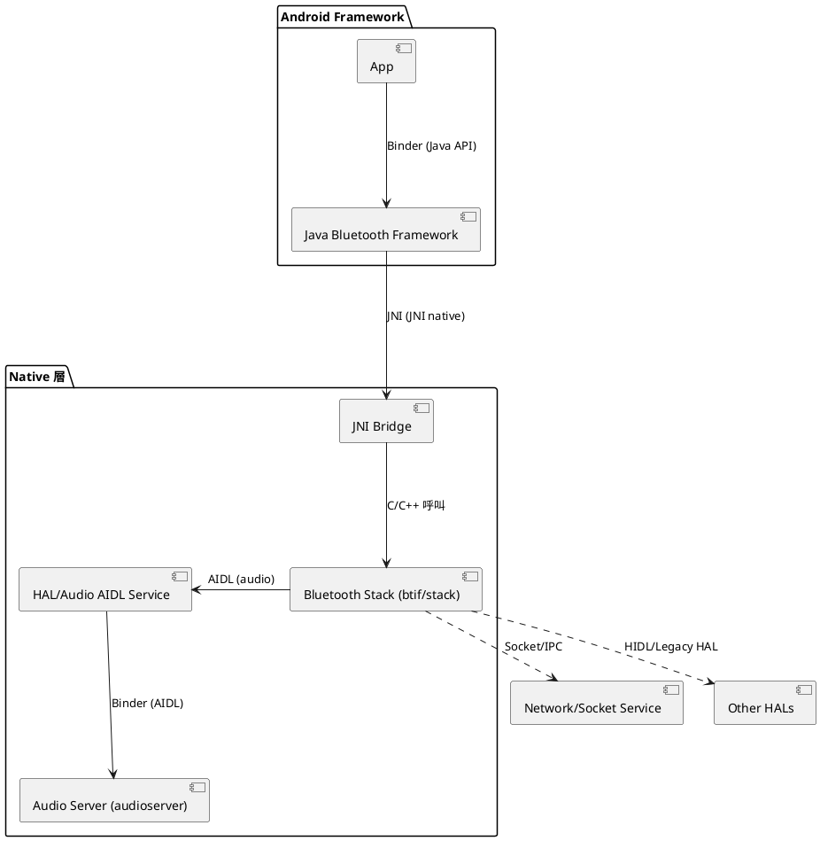
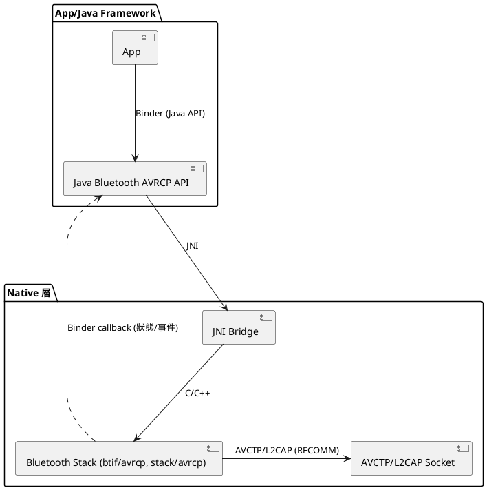

# Android Bluetooth Stack 與其他模組溝通架構圖

本圖說明 Bluetooth stack 在 Android 系統中，與其他核心模組（如 audio server、Java framework、App 層等）之間的溝通方式，並標示各自使用的介面型態。

---

---

## 說明
- **A2DP Source <-> Audio Server**：透過 audio AIDL 介面溝通（如本文件前述流程）
- **Java Framework <-> Native Bluetooth**：透過 JNI
- **App <-> Java Framework**：透過 Binder (Java API)
- **Bluetooth Stack <-> 其他 HAL**：可能用 HIDL 或傳統 HAL
- **Bluetooth Stack <-> 其他 IPC/網路服務**：可能用 Socket/自訂 IPC

此圖可協助理解 Android 藍牙架構中，各層之間的溝通路徑與技術。

---

# AVRCP 與外部溝通的 Components 與介面

AVRCP（Audio/Video Remote Control Profile）在 Android Bluetooth stack 中，與外部溝通主要涉及下列 components 與介面：

- **AVRCP Controller/Target**：可同時支援兩個 L2CAP channel（CT/TG）
- **與 Java 層溝通**：JNI + Binder
- **與遠端裝置溝通**：AVCTP/L2CAP（底層為 socket）
- **部分 profile 也有 AIDL 介面（如 IBluetoothAvrcpController.aidl）供 Java 層呼叫**

---

# Bluetooth Stack 主要 Thread/Process 列表

| 名稱                | 層級/模組         | 說明                                                         |
|---------------------|-------------------|--------------------------------------------------------------|
| Main thread         | Native stack      | Bluetooth stack 主執行緒，負責大部分 profile 處理            |
| JNI thread          | JNI bridge        | 負責 Java <-> Native 間的 JNI 呼叫與回調                     |
| HCI thread          | Native stack      | 負責與藍牙硬體 HCI 層通訊，處理底層 I/O                      |
| Audio worker thread | Native stack      | 負責 audio 資料編解碼、與 audio HAL 溝通                     |
| Socket I/O thread   | Native stack      | 處理 RFCOMM/L2CAP socket 連線與資料傳輸                      |
| Profile 專屬 thread | Profile module    | 某些 profile（如 OPP、PBAP）會有自己的 handler thread        |
| Java HandlerThread  | Java 層           | 例如 AdapterService、ProfileService 各自的 HandlerThread     |
| App process         | App 層            | 各應用程式自己的進程與執行緒                                 |
| Audio Server        | System service    | audioserver 進程，負責 audio HAL 與 AIDL 服務                |
| HAL process         | Vendor/硬體層     | 實作 HIDL/AIDL HAL 的 vendor 進程                            |

- **Gabeldorsche (GD) stack** 也有 Handler/Module 概念，主執行緒可再細分為多個 handler
- **Socket I/O thread** 由 `btif_sock_thread` 管理
- **Profile thread** 例如 OPP、PBAP、MAP 等 profile 會有自己的 thread 處理資料庫或 I/O
- **Java HandlerThread** 例如 `BluetoothManagerService`、`BluetoothOppService` 等

---

# 小結
- AVRCP 與外部溝通主要透過 JNI、Binder、AVCTP/L2CAP socket，部分 profile 也有 AIDL 介面
- Bluetooth stack 內部有多個 thread/process，確保各 profile、I/O、audio、JNI 等能高效運作
- 這些設計讓 Android 藍牙架構能同時支援多 profile 並與系統各層協同運作
